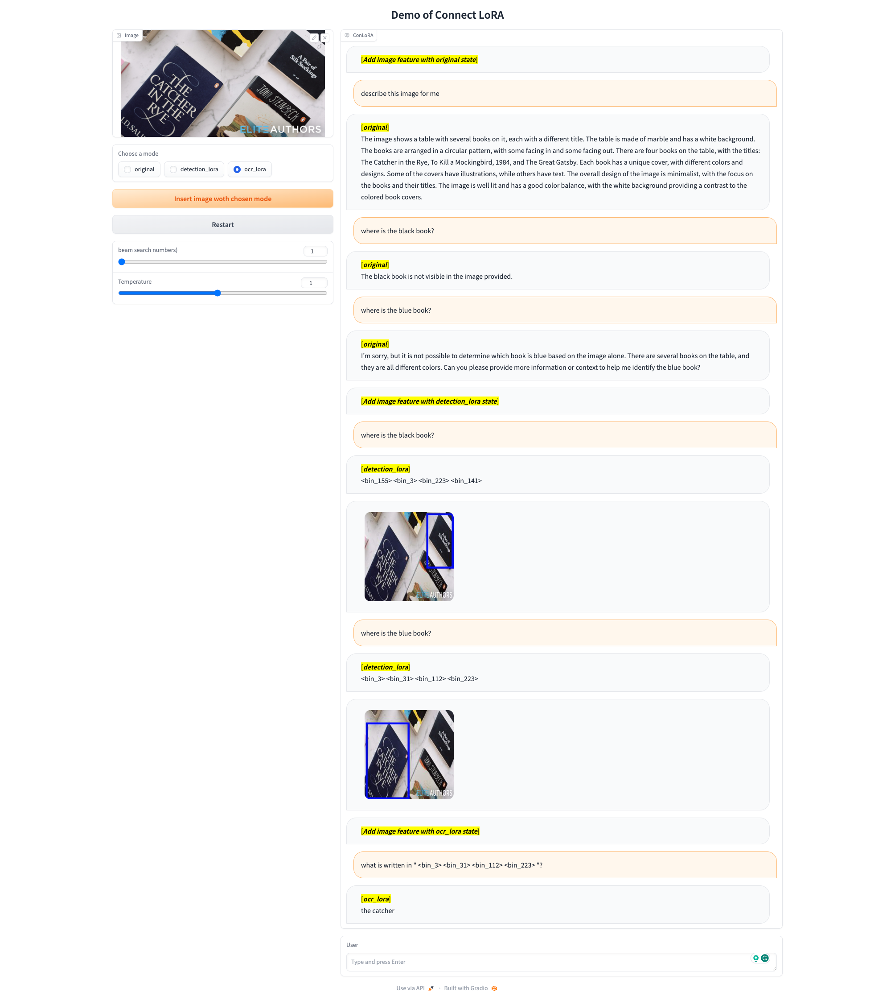
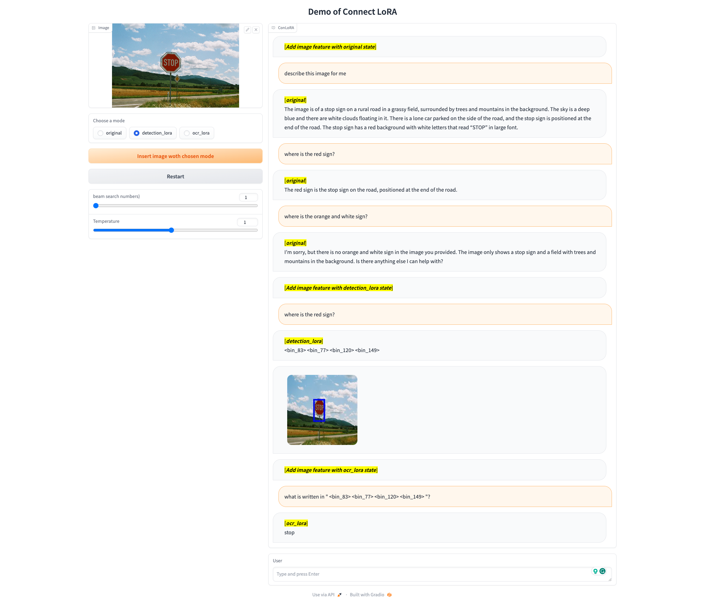
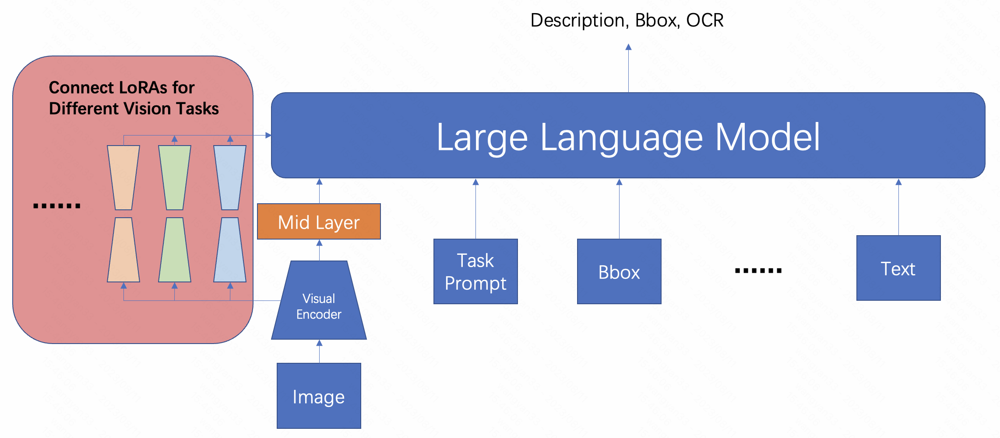

# ConLoRA: Connect Visual and Language Model across Different Tasks

[//]: # ([Deyao Zhu]&#40;https://tsutikgiau.github.io/&#41;* &#40;On Job Market!&#41;, [Jun Chen]&#40;https://junchen14.github.io/&#41;* &#40;On Job Market!&#41;, [Xiaoqian Shen]&#40;https://xiaoqian-shen.github.io&#41;, [Xiang Li]&#40;https://xiangli.ac.cn&#41;, and [Mohamed Elhoseiny]&#40;https://www.mohamed-elhoseiny.com/&#41;. *Equal Contribution)

[//]: # (**King Abdullah University of Science and Technology**)

[//]: # (<a href='https://minigpt-4.github.io'></a>  <a href='https://arxiv.org/abs/2304.10592'></a> <a href='https://huggingface.co/spaces/Vision-CAIR/minigpt4'></a> <a href='https://huggingface.co/Vision-CAIR/MiniGPT-4'></a> [![Colab]&#40;https://colab.research.google.com/assets/colab-badge.svg&#41;]&#40;https://colab.research.google.com/drive/1OK4kYsZphwt5DXchKkzMBjYF6jnkqh4R?usp=sharing&#41; [![YouTube]&#40;https://badges.aleen42.com/src/youtube.svg&#41;]&#40;https://www.youtube.com/watch?v=__tftoxpBAw&feature=youtu.be&#41;)


## 🚧 Warning: This project is still under development, code and features may be modified and deprecated

[//]: # (We now provide a pretrained MiniGPT-4 aligned with Vicuna-7B! The demo GPU memory consumption now can be as low as 12GB.)

## TODO List:
- [ ] Support for open domain APIs
- [ ] Train more lora for more tasks, and add them to model's select list 
- [ ] Make model automatically select which lora is needed to complete the user's task 
- [x] Support for multi-round chat
- [x] Let user choose lora type in the demo interface
- [x] Lora for OCR task
- [x] Lora for visual grounding task


[//]: # (## Online Demo)

[//]: # ()
[//]: # (Click the image to chat with MiniGPT-4 around your images)

[//]: # ([![demo]&#40;figs/online_demo.png&#41;]&#40;https://minigpt-4.github.io&#41;)


## Examples



[//]: # (  |   |   |)

[//]: # (:-------------------------:|:-------------------------:)

[//]: # (![find wild]&#40;figs/examples/wop_2.png&#41; |  ![write story]&#40;figs/examples/ad_2.png&#41;)

[//]: # (![solve problem]&#40;figs/examples/fix_1.png&#41;  |  ![write Poem]&#40;figs/examples/rhyme_1.png&#41;)

[//]: # (More examples can be found in the [project page]&#40;https://minigpt-4.github.io&#41;.)


## Introduction
- This project is started from Mini-GPT4 which is a image-text QA project. 
- We use LoRA in ViT, Mid-layer(Q-former) and LLm to align visual and language feature as well as different tasks.
- We only add LoRA for upper layer of ViT, which allows one vision model to be adapted to different vision tasks.





[//]: # (## Getting Started)

[//]: # (### Installation)

[//]: # ()
[//]: # (**1. Prepare the code and the environment**)

[//]: # ()
[//]: # (Git clone our repository, creating a python environment and ativate it via the following command)

[//]: # ()
[//]: # (```bash)

[//]: # (git clone https://github.com/Vision-CAIR/MiniGPT-4.git)

[//]: # (cd MiniGPT-4)

[//]: # (conda env create -f environment.yml)

[//]: # (conda activate minigpt4)

[//]: # (```)

[//]: # ()
[//]: # ()
[//]: # (**2. Prepare the pretrained Vicuna weights**)

[//]: # ()
[//]: # (The current version of MiniGPT-4 is built on the v0 versoin of Vicuna-13B.)

[//]: # (Please refer to our instruction [here]&#40;PrepareVicuna.md&#41; )

[//]: # (to prepare the Vicuna weights.)

[//]: # (The final weights would be in a single folder in a structure similar to the following:)

[//]: # ()
[//]: # (```)

[//]: # (vicuna_weights)

[//]: # (├── config.json)

[//]: # (├── generation_config.json)

[//]: # (├── pytorch_model.bin.index.json)

[//]: # (├── pytorch_model-00001-of-00003.bin)

[//]: # (...   )

[//]: # (```)

[//]: # ()
[//]: # (Then, set the path to the vicuna weight in the model config file )

[//]: # ([here]&#40;minigpt4/configs/models/minigpt4.yaml#L16&#41; at Line 16.)

[//]: # ()
[//]: # (**3. Prepare the pretrained MiniGPT-4 checkpoint**)

[//]: # ()
[//]: # (Download the pretrained checkpoints according to the Vicuna model you prepare.)

[//]: # ()
[//]: # (|                                Checkpoint Aligned with Vicuna 13B                                |                               Checkpoint Aligned with Vicuna 7B                                |)

[//]: # (:------------------------------------------------------------------------------------------------:|:----------------------------------------------------------------------------------------------:)

[//]: # ( [Downlad]&#40;https://drive.google.com/file/d/1a4zLvaiDBr-36pasffmgpvH5P7CKmpze/view?usp=share_link&#41; | [Download]&#40;https://drive.google.com/file/d/1RY9jV0dyqLX-o38LrumkKRh6Jtaop58R/view?usp=sharing&#41; )

[//]: # ()
[//]: # ()
[//]: # (Then, set the path to the pretrained checkpoint in the evaluation config file )

[//]: # (in [eval_configs/minigpt4_eval.yaml]&#40;eval_configs/minigpt4_eval.yaml#L10&#41; at Line 11. )

[//]: # ()
[//]: # ()
[//]: # ()
[//]: # (### Launching Demo Locally)

[//]: # ()
[//]: # (Try out our demo [demo.py]&#40;demo.py&#41; on your local machine by running)

[//]: # ()
[//]: # (```)

[//]: # (python demo.py --cfg-path eval_configs/minigpt4_eval.yaml  --gpu-id 0)

[//]: # (```)

[//]: # ()
[//]: # (To save GPU memory, Vicuna loads as 8 bit by default, with a beam search width of 1. )

[//]: # (This configuration requires about 23G GPU memory for Vicuna 13B and 11.5G GPU memory for Vicuna 7B. )

[//]: # (For more powerful GPUs, you can run the model)

[//]: # (in 16 bit by setting low_resource to False in the config file )

[//]: # ([minigpt4_eval.yaml]&#40;eval_configs/minigpt4_eval.yaml&#41; and use a larger beam search width.)

[//]: # ()
[//]: # (Thanks [@WangRongsheng]&#40;https://github.com/WangRongsheng&#41;, you can also run our code on [Colab]&#40;https://colab.research.google.com/drive/1OK4kYsZphwt5DXchKkzMBjYF6jnkqh4R?usp=sharing&#41;)

[//]: # ()
[//]: # ()
[//]: # (### Training)

[//]: # (The training of MiniGPT-4 contains two alignment stages.)

[//]: # ()
[//]: # (**1. First pretraining stage**)

[//]: # ()
[//]: # (In the first pretrained stage, the model is trained using image-text pairs from Laion and CC datasets)

[//]: # (to align the vision and language model. To download and prepare the datasets, please check )

[//]: # (our [first stage dataset preparation instruction]&#40;dataset/README_1_STAGE.md&#41;. )

[//]: # (After the first stage, the visual features are mapped and can be understood by the language)

[//]: # (model.)

[//]: # (To launch the first stage training, run the following command. In our experiments, we use 4 A100. )

[//]: # (You can change the save path in the config file )

[//]: # ([train_configs/minigpt4_stage1_pretrain.yaml]&#40;train_configs/minigpt4_stage1_pretrain.yaml&#41;)

[//]: # ()
[//]: # (```bash)

[//]: # (torchrun --nproc-per-node NUM_GPU train.py --cfg-path train_configs/minigpt4_stage1_pretrain.yaml)

[//]: # (```)

[//]: # ()
[//]: # (A MiniGPT-4 checkpoint with only stage one training can be downloaded )

[//]: # ([here &#40;13B&#41;]&#40;https://drive.google.com/file/d/1u9FRRBB3VovP1HxCAlpD9Lw4t4P6-Yq8/view?usp=share_link&#41; or [here &#40;7B&#41;]&#40;https://drive.google.com/file/d/1HihQtCEXUyBM1i9DQbaK934wW3TZi-h5/view?usp=share_link&#41;.)

[//]: # (Compared to the model after stage two, this checkpoint generate incomplete and repeated sentences frequently.)

[//]: # ()
[//]: # ()
[//]: # (**2. Second finetuning stage**)

[//]: # ()
[//]: # (In the second stage, we use a small high quality image-text pair dataset created by ourselves)

[//]: # (and convert it to a conversation format to further align MiniGPT-4.)

[//]: # (To download and prepare our second stage dataset, please check our )

[//]: # ([second stage dataset preparation instruction]&#40;dataset/README_2_STAGE.md&#41;.)

[//]: # (To launch the second stage alignment, )

[//]: # (first specify the path to the checkpoint file trained in stage 1 in )

[//]: # ([train_configs/minigpt4_stage1_pretrain.yaml]&#40;train_configs/minigpt4_stage2_finetune.yaml&#41;.)

[//]: # (You can also specify the output path there. )

[//]: # (Then, run the following command. In our experiments, we use 1 A100.)

[//]: # ()
[//]: # (```bash)

[//]: # (torchrun --nproc-per-node NUM_GPU train.py --cfg-path train_configs/minigpt4_stage2_finetune.yaml)

[//]: # (```)

[//]: # ()
[//]: # (After the second stage alignment, MiniGPT-4 is able to talk about the image coherently and user-friendly. )


## Acknowledgement
+ [Mini-GPT4](https://github.com/Vision-CAIR/MiniGPT-4) This repository is currently built upon Mini-GPT4, thanks for their codes and pretrained weight.

[//]: # (+ [BLIP2]&#40;https://huggingface.co/docs/transformers/main/model_doc/blip-2&#41; The model architecture of MiniGPT-4 follows BLIP-2. Don't forget to check this great open-source work if you don't know it before!)
[//]: # (+ [Lavis]&#40;https://github.com/salesforce/LAVIS&#41; This repository is built upon Lavis!)
[//]: # (+ [Vicuna]&#40;https://github.com/lm-sys/FastChat&#41; The fantastic language ability of Vicuna with only 13B parameters is just amazing. And it is open-source!)


[//]: # (If you're using MiniGPT-4 in your research or applications, please cite using this BibTeX:)

[//]: # (```bibtex)

[//]: # (@article{zhu2023minigpt,)

[//]: # (  title={MiniGPT-4: Enhancing Vision-Language Understanding with Advanced Large Language Models},)

[//]: # (  author={Zhu, Deyao and Chen, Jun and Shen, Xiaoqian and Li, Xiang and Elhoseiny, Mohamed},)

[//]: # (  journal={arXiv preprint arXiv:2304.10592},)

[//]: # (  year={2023})

[//]: # (})

[//]: # (```)


## License
This repository is under [BSD 3-Clause License](LICENSE.md).
Many codes are based on [Lavis](https://github.com/salesforce/LAVIS) with 
BSD 3-Clause License [here](LICENSE_Lavis.md).
